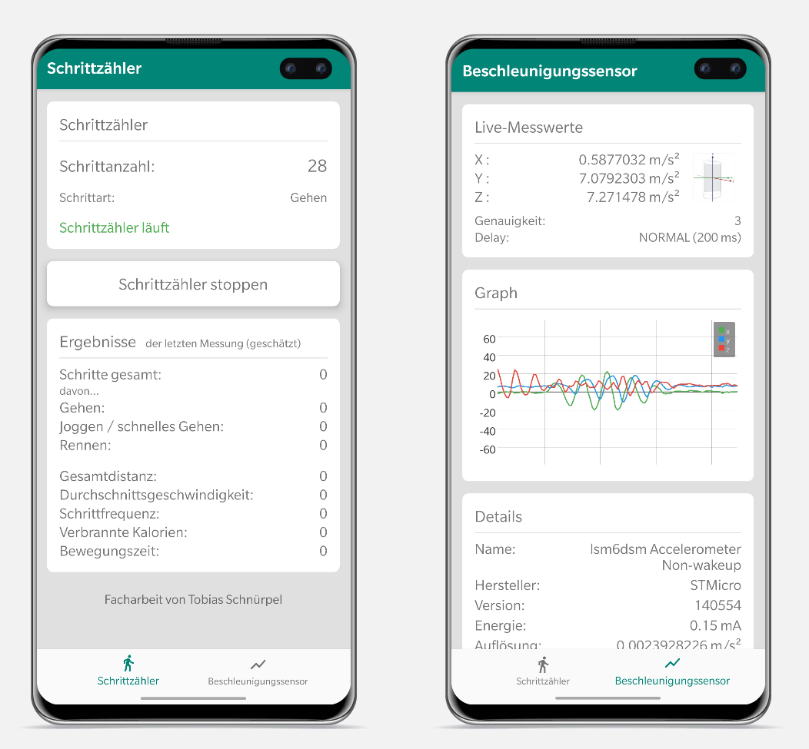

# Android step counter (with Accelerometer)
Native Android app that counts the user's steps with the accelerometer.

Just to demonstrate this way of step counting. The main parts of this simple algorithm can be found in the class [StepDetector.java](app/src/main/java/com/tobias/schrittzaehlerfacharbeit/StepDetector.java).
Most of the comments are in German.

